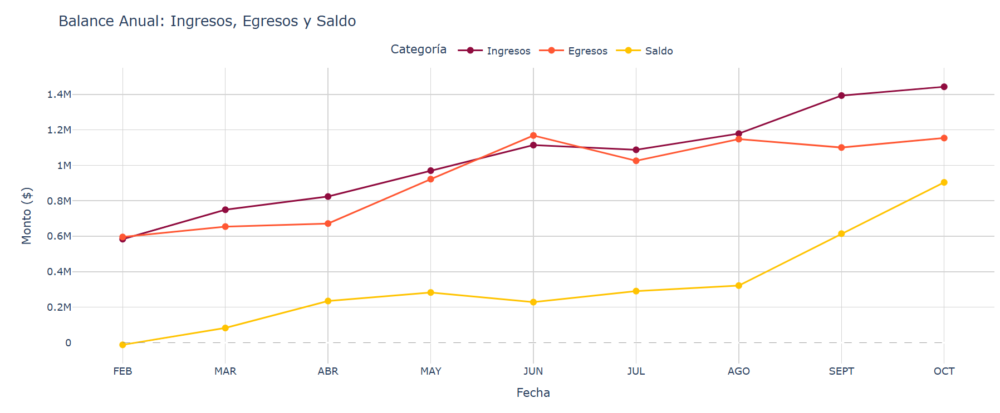
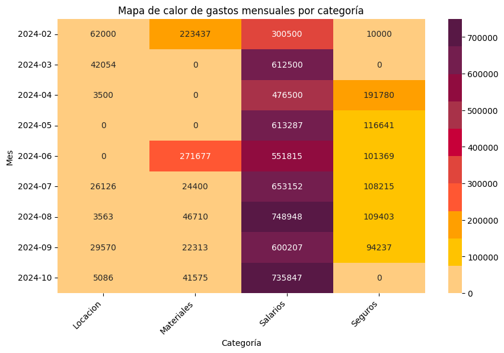
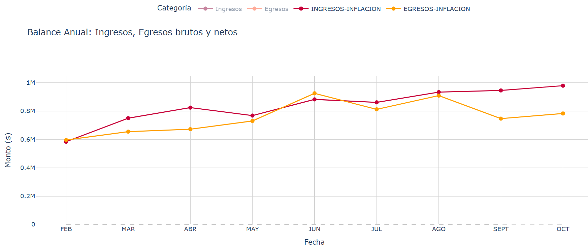
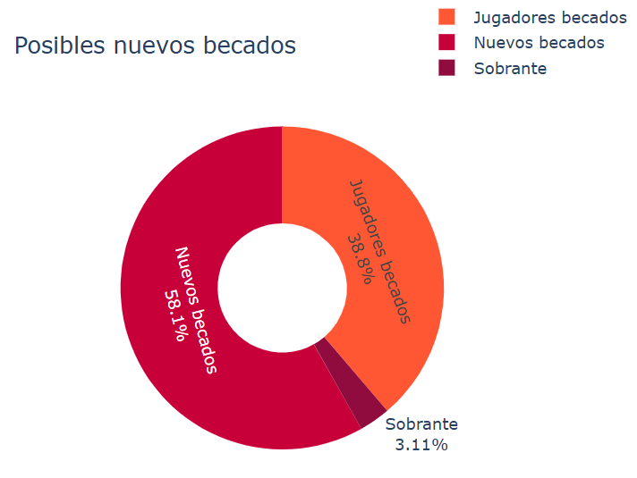
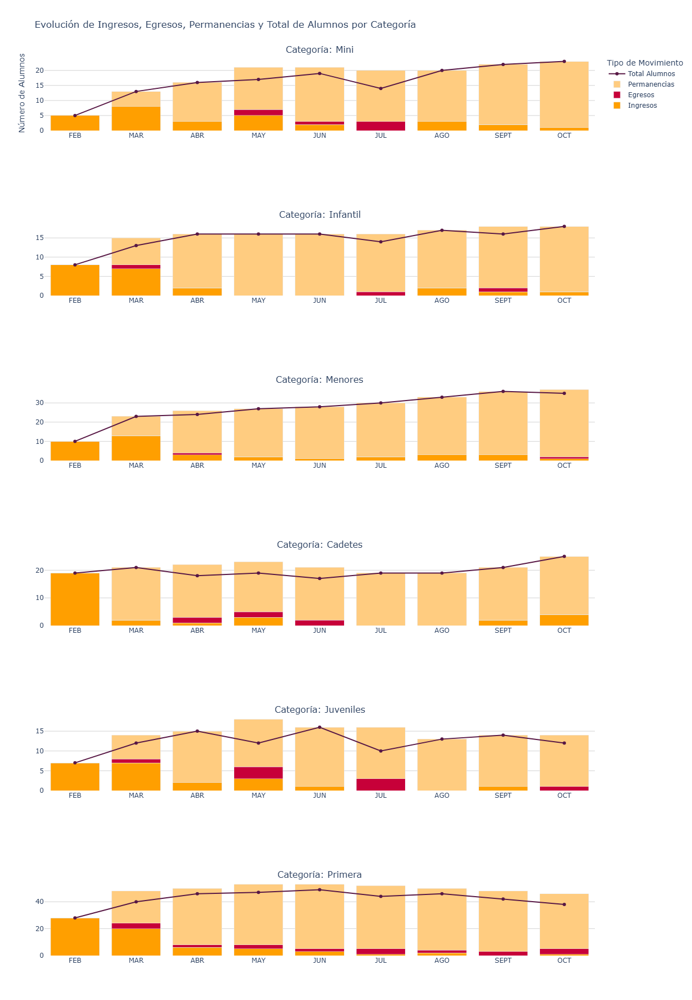
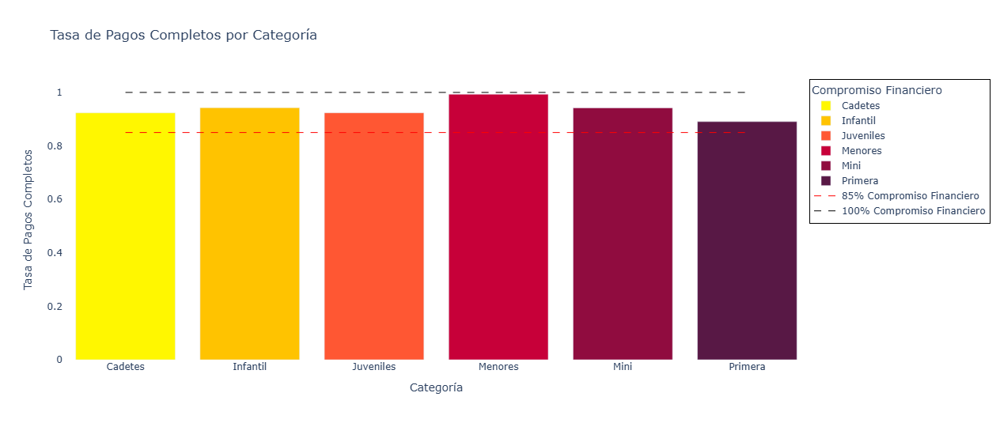

# 📊 Análisis Financiero y de Membresía: Maximizando la Sostenibilidad del Club de Handball Rio Negro 🏐
Autor: Maria Emilia Tartaglia
Fecha: Noviembre 2024

## Tabla de Contenidos
- [Resumen Ejecutivo](#resumen-ejecutivo)
- [Contexto y Desafío](#contexto-y-desafío)
- [Enfoque y Metodología](#enfoque-y-metodología)
- [Análisis Exploratorio y Hallazgos Clave para Handball](#análisis-exploratorio-y-hallazgos-clave-para-handball)
- [Recomendaciones Clave para la Sostenibilidad Financiera](#recomendaciones-clave-para-la-sostenibilidad-financiera)

##  Resumen Ejecutivo

Este análisis exploratorio de datos (EDA) del Club de Handball Rio Negro revela insights clave sobre su situación financiera y de membresía. Se identificaron oportunidades para optimizar gastos, aumentar ingresos a través de eventos, y mejorar la retención de socios. Las recomendaciones propuestas buscan fortalecer la sostenibilidad financiera del club a largo plazo.

## Contexto y Desafío

El Club de Handball Rio Negro, una organización deportiva amateur fundada en 2023 y autogestionada por sus jugadores, me contactó para abordar un desafío crucial: asegurar su sostenibilidad financiera a largo plazo.  Dependiendo en gran medida de las cuotas de socios, el club enfrenta desafíos relacionados con la inflación, la estacionalidad en la membresía y la necesidad de optimizar gastos.

## Enfoque y Metodología

### 🔍 El Desafío: Navegando la Sostenibilidad Financiera
El Club de Handball Rio Negro, como muchas organizaciones deportivas sin fines de lucro, depende en gran medida de las cuotas de sus socios para operar. Esta dependencia, combinada con factores como la inflación y la fluctuación en la membresía, plantea desafíos para su sostenibilidad financiera a largo plazo.

### ❓ **Nuestras Preguntas Clave**

Para abordar este desafío, nos planteamos las siguientes preguntas clave:

1. ¿Es la estructura actual de ingresos y gastos del club suficiente para garantizar su sostenibilidad a largo plazo?

2. ¿Cómo influye la estacionalidad en la rotación de socios y cuál es su impacto en los ingresos?

3. ¿Cuál es el nivel de compromiso financiero de los socios por categoría y cómo podemos mejorarlo?

4. ¿Cómo se distribuyen los gastos del club y dónde existen oportunidades de optimización?

### 🔍 Hipótesis Fundamentales: 

Guiados por estas preguntas, establecimos las siguientes hipótesis:

- **Hipótesis Principal**: La estructura financiera actual del club no es suficiente para asegurar su sostenibilidad a largo plazo sin una optimización de gastos y la diversificación de fuentes de ingresos.
- **Hipótesis Secundarias**: 
    * La rotación de socios varía a lo largo del año, especialmente durante los períodos de vacaciones y cierre de temporada.
    * Existen diferencias en el compromiso financiero entre las distintas categorías de socios.
    * Los salarios representan la mayor proporción de los gastos del club, pero existen oportunidades de optimización en otras categorías, como materiales y alquiler de instalaciones.

### 🛠️ Metodología

Para validar estas hipótesis, empleamos un enfoque de análisis de datos riguroso, utilizando herramientas y técnicas como:

*   **Lenguaje de Programación:** Python, con las bibliotecas Pandas, Matplotlib, Seaborn y Plotly para la manipulación, análisis y visualización de datos.
*   **Análisis Exploratorio de Datos (EDA):** Para identificar patrones, tendencias y relaciones en los datos financieros y de membresía del club.
*   **Análisis de Tendencias:** Para examinar la evolución de los ingresos, gastos y el saldo acumulado del club a lo largo del tiempo.
*   **Simulación de Escenarios:** Para evaluar el impacto de diferentes estrategias, como la implementación de becas adicionales o la organización de eventos de recaudación de fondos, en la sostenibilidad financiera del club.

### 📁  Estructura de Datos
Estan todos en formato CSV, son un total de 32 archivos. 

Los archivos de datos utilizados en este proyecto contienen información sensible del Club de Handball Rio Negro, por lo que no se incluyen en este repositorio. Sin embargo, el script de análisis EDA_analysis.py está diseñado para funcionar con datos anonimizados o simulados que cumplan con la estructura requerida.

1.	**Listado de Afiliados al Club**: Datos de los socios, incluyendo nombre, edad, género y categoría.
2.	**Listado de Jugadores Becados**: Información sobre becas parciales o completas de socios.
3.	**Registro de Pagos de Cuotas por Categoría**: Detalle de pagos mensuales de socios.
4.	**Control de Ingresos y Egresos**: Historial de ingresos (cuotas, eventos, sponsors) y egresos (salarios, materiales, seguros).
Cada dataset proviene de registros administrativos internos del club y contiene datos desde febrero hasta octubre de 2024.

## Análisis Exploratorio y Hallazgos Clave para Handball

Se explicarán los hallazgos más importantes para las categorías de Handball. Si se quieren ver los hallazgos para Vóley, se recomienda visualizar la memoria que se adjunta a este repositorio. 

### 1. Análisis Financiero Mensual

📈 **Hallazgo Clave**: Los ingresos mensuales del club generalmente superan los gastos, lo que indica una buena gestión financiera en términos generales. Sin embargo, se identificaron dos meses (febrero y junio) con gastos significativamente más altos. 

En el siguiente gráfico se visualizan los ingresos, egresos y el saldo que se acumula mes a mes hacia fin de año. 

📊 **Análisis**: Se examinaron los gastos por categoría mes a mes, para encontrar una explicación al hallazgo del punto anterior, y se llegó a la conclusión de que en los meses de febrero y junio se han realizado gastos extraordinarios en materiales, ya que es justamente el inicio de las dos temporadas del año. Esto se advierte claramente en el siguiente mapa de calor: 

### 2. Impacto de la Inflación

*Para analizar la sostenibilidad de los ingresos, se incorporaron ajustes a las cuotas debido a la inflación del país (Argentina). Estos coeficientes de inflaición se aplicaron para calcular el monto ajustado de ingresos y egresos netos, y evitar conclusiones erróneas.*

📈 **Hallazgo Clave**: El ajuste de las cuotas de los socios según la inflación ha permitido mantener los ingresos en términos reales. No obstante, se requiere una gestión cuidadosa de los gastos para asegurar la sostenibilidad a largo plazo. 
En el siguiente Scatter se visualizan los valores "reales" de ingresos y egresos

 

📊 **Análisis**: A través de estos ajustes de inflación, se puede mantener el valor real de los ingresos.
- Comparamos los ingresos y egresos netos con los valores reales. En lineas generales, ambos crecen muy paulatinamente y a la par, con algunas diferencias en meses particulares, que luego vuelven a acomodarse hacia fin del año
- Cerramos el año con un aumento del 40.36% para los ingresos y de 23.85% para los egresos. 

### 3. Becas y Sostenibilidad
📈 **Hallazgo Clave**: Los jugadores becados representan un desafío para los ingresos del club, pero a través de la simulación realizada, se ha determinado que con la organización de eventos de recaudación de fondos, el club podría ampliar el número de becas otorgadas.

📊 **Análisis**: Con los $ 209000 recaudados, se podrían becar 9 jugadores al 100% durante un mes, o bien 1 jugador al 100% durante todo el año.

Este análisis está representado en el siguiente gráfico donut, que representa un monto de $ 209000 como total, que hoy podria costear el 38.8% de jugadores becados actualmente, mas un 58.1% de nuevos jugadores, con un leve sobrante de un 3%. O lo que es lo mismo: 

- 6 jugadores becados al 100% representan $ 81000 ($13500 cada uno).   
    
- Restando esos $81000 de los $209000, obtenemos el valor restante para calcular cuántos jugadores más podrían ser becados hasta cubrir el total.
     

### 4. Estacionalidad en la Rotación de Socios
📈 **Hallazgo Clave**: Se identificó una estacionalidad en la rotación de socios del Club de Handball Rio Negro, con una disminución notable en la membresía durante los meses de junio, julio y agosto, que coinciden con el receso vacacional. A pesar de esta fluctuación, el club demuestra una sólida retención de socios, ya que la mayoría de los que se dan de baja en esos meses, se reincorporan luego.

📊 **Análisis**: El análisis de los registros de pago de las categorías de Vóley y Handball reveló un patrón claro de disminución de socios durante los meses de receso vacacional. Esta tendencia es consistente en ambas disciplinas y sugiere que la estacionalidad juega un papel importante en la retención de miembros.

Si bien la baja en la membresía durante estos meses podría generar preocupación, es importante destacar que el índice de retención se mantiene alto. Esto indica que la mayoría de los socios que se dan de baja durante las vacaciones vuelven a inscribirse una vez que finaliza el receso.

Este hallazgo sugiere que las fluctuaciones en la membresía son en gran medida temporales y están relacionadas con el período vacacional. Sin embargo, es fundamental que el club tome medidas para minimizar el impacto de esta estacionalidad en sus ingresos y asegurar una transición fluida durante los meses de menor actividad.

### 5. Compromiso Financiero
📈 **Hallazgo Clave**: A pesar de la presencia de deudas en algunas categorías, el Club de Handball Rio Negro demuestra un alto nivel de compromiso financiero por parte de sus socios. La tasa de cumplimiento de pagos, calculada a través del promedio anual de pagos completos y parciales, supera el 85% en todas las categorías, lo que indica una sólida base de ingresos por cuotas.

A través del siguiente gráfico de barras se visualiza que la tasa de compromiso supera el 85% en todas las categorías. Este indicador se calculó utilizando valores enteros (1 para pago completo, 0 para no pago, y decimales para pagos parciales), los cuales luego fueron promediados mes a mes y agrupados por categoría, obteniendo así una tasa promedio de cumplimiento de pagos.

📊 **Análisis**
El análisis del comportamiento de pago de los socios revela que, si bien existen deudas pendientes en algunas categorías, la tendencia general de pago es positiva. La alta tasa de compromiso financiero observada en todas las categorías sugiere que la mayoría de los socios cumplen con sus obligaciones económicas, lo que contribuye a la estabilidad financiera del club.

El gráfico de barras incluido en la memoria visualiza claramente las deudas por categoría, permitiendo identificar aquellas con mayor índice de morosidad. Sin embargo, al analizar los pagos a lo largo del año, se observa que incluso las categorías con deudas muestran un compromiso financiero sólido, con una tasa de cumplimiento que supera el 85%.

Este hallazgo destaca la importancia de no centrarse únicamente en las deudas puntuales, sino también en la tendencia general de pago de los socios. La alta tasa de compromiso financiero sugiere que la mayoría de los socios tienen la intención de cumplir con sus pagos, y que las deudas podrían ser resultado de circunstancias temporales o dificultades económicas puntuales.

## Recomendaciones Clave para la Sostenibilidad Financiera

Basándonos en los hallazgos clave de este análisis, proponemos las siguientes recomendaciones para fortalecer la sostenibilidad financiera del Club de Handball Rio Negro:

✅ **Impulsar Eventos Estratégicos**: Diseñar un calendario de eventos de recaudación diversificado y con objetivos claros para aumentar los ingresos y apoyar el programa de becas.

✅ **Optimizar Gastos Clave**: Identificar y reducir gastos en áreas como materiales y alquileres, sin comprometer la calidad del servicio, para mejorar el margen financiero.

✅ **Fidelizar Socios en Momentos Clave**: Implementar estrategias de retención proactivas durante los meses de receso vacacional (junio, julio y agosto) para minimizar la deserción y asegurar ingresos estables.

✅ **Promover una Cultura de Pago Puntual**: Implementar un sistema de seguimiento de deudas y comunicación personalizada con los socios para fomentar el pago puntual de cuotas.
